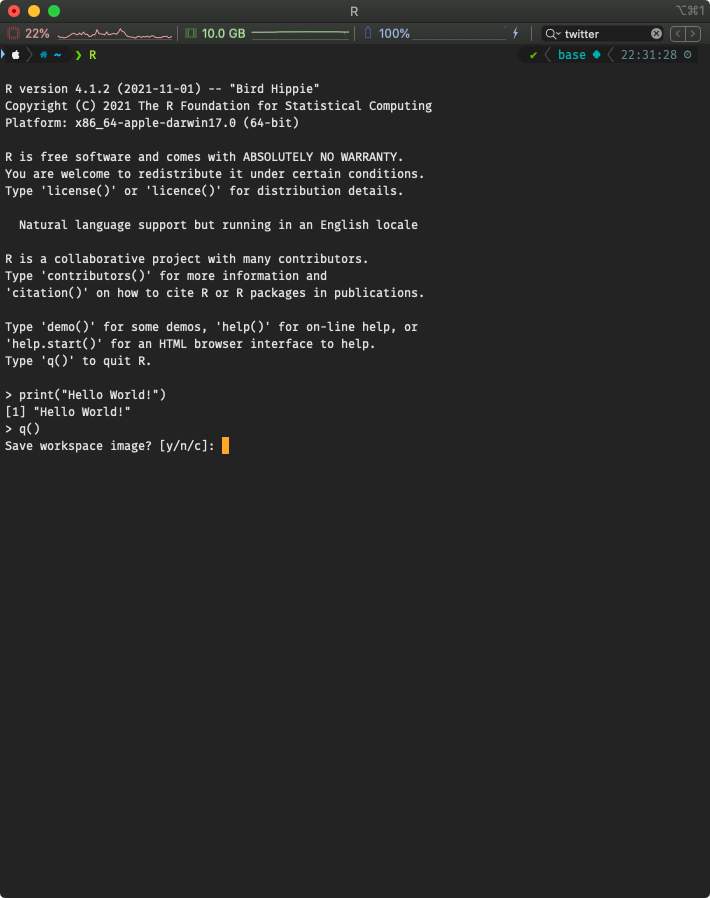
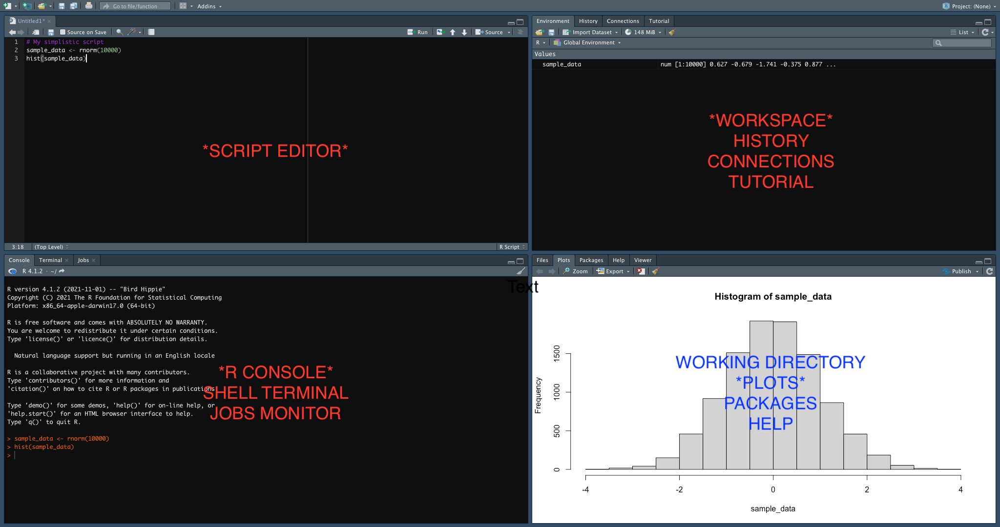

## Introduction to R

R is a free software environment for statistical computing and graphics. It compiles and runs on a wide variety of operating systems including Windows, MacOS and assorted linux distributions.

RStudio is a set of integrated tools designed to help you be more productive with R. This is referred to as an Integrated Development Environment or IDE. Alternative IDEs for R include [RKWard](https://rkward.kde.org) and even [Visual Studio Code](https://code.visualstudio.com) when [properly configured](https://medium.com/analytics-vidhya/a-fresh-start-for-r-in-vscode-ec61ed108cf6).

--- .class #id 

## Installing R

If you have administrative access to the computer you are using you should be able to install the R and RStudio programs. If you do not have admin access you can try RStudio Cloud.

| To Install &nbsp; &nbsp; &nbsp; &nbsp; &nbsp; &nbsp; &nbsp; &nbsp;   | Go to |
|:--------------------------------------------------------------------:|-------|
| R             | [R homepage](https://www.r-project.org) and follow the links to CRAN (Comprehensive R Access Network), selecting a mirror site near your current location, |
| RStudio       | [RStudio.com](https://www.rstudio.com/products/rstudio/download/) and choose the open source "Desktop edition", |
| RStudio Cloud | [RStudio Cloud](https://rstudio.cloud) and sign up for a free account. |

--- .class #id 

## The R Environment

The text-based R environment is known as the **console** and is accessible via:

| A Terminal Emulator                   | R Standalone App           |
|---------------------------------------|----------------------------|
|  |  |

--- .class #id 

## RStudio GUI

Here is what the RStudio Graphical User Interface (GUI) looks like:



--- .class #id 

## Getting Help

Getting help from R's built-in facility. For a given function "makecupcake" you can invoke the help pages using the `?` character. For this example you would type the following into the console:


```r
?makecupcakes
```

Note that the console has a flashing cursor just to the right of a `>` character. The `>` is known as the prompt command and it means that R is expecting you to input a command.

Let's try this for a more informative function:


```r
?mean
```
What did you get when you did this in RStudio?

--- .class #id 

## Help via Fuzzy Search

Do you need more information or can't you find what you are looking for? Use `??`:


```r
??"cupcakes"
```

Also you can obtain more details on features specified by special characters:

```r
?"[["
```

We'll try some of these in the next slide.

--- .class #id 

## Fuzzy Search Examples

Let's try a couple:


```r
??"average"
?"%*%"
```

Let's try something new (and please don't be frustrated by the result!). Type the following command:


```r
q()
```

What happened?

--- .class #id 

## Fetching Examples

To get an example of the use of a function (or topic), you can try:


```r
example(cupcakes)
```

Have a go yourself:


```r
example(mean)
```

```
## 
## mean> x <- c(0:10, 50)
## 
## mean> xm <- mean(x)
## 
## mean> c(xm, mean(x, trim = 0.10))
## [1] 8.75 5.50
```

Try the same for the `sd` function. Can you figure out what it does?

--- .class #id 

## Bracket Meltdown! (and how to avoid it...)

If a command is not complete at the end of a line, R will give a different prompt, by default this is `+`.

You will experience this a lot. So be careful with opening and closing your brackets, for example try:


```r
mean(c(1,2,4,3)
```

You will see the prompt transform into a `+` meaning that it expects more input. To get out of this you can do one of two things:

> 1. close all the braces in the expression (in this case this means adding another `)`), or
> 2. (if you can't figure it out) press the "Escape" key on your keyboard.

Option 2 will cancel the command, but will rescue you from bracket meltdown.

--- .class #id 

## THE END
